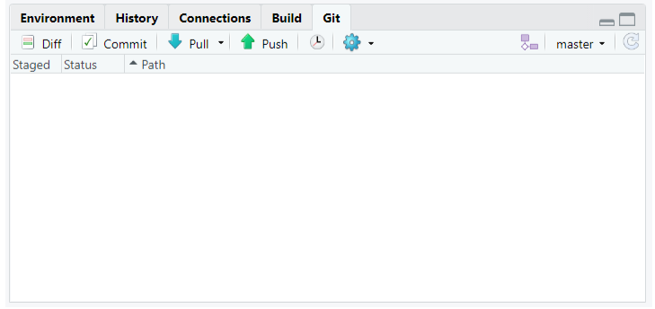

```{r setup, include=FALSE}
knitr::opts_chunk$set(
  #echo = FALSE,
  #message = FALSE,
  warning = FALSE,
  fig.width = 12,
  fig.height = 7
  )
```

```{r, include=FALSE}
library(patchwork)
library(tidyverse)
library(gridtext)
```

## Projetos

Uma funcionalidade muito importante do RStudio é a possibilidade de criar projetos.

Um projeto é uma pasta no seu computador. Nessa pasta, estarão todos os arquivos que você usurá ou criará na sua análise.

A principal razão de utilizarmos projetos é organização. Com eles, fica muito mais fácil importar bases de dados para dentro do R, criar análises reprodutíveis e compartilhar o nosso trabalho.


## Rstudio e um projeto


## Git {.flexbox .vcenter}


## Github {.flexbox .vcenter}


## Git Pane {.flexbox .vcenter}


## Git Status {.flexbox .vcenter}
