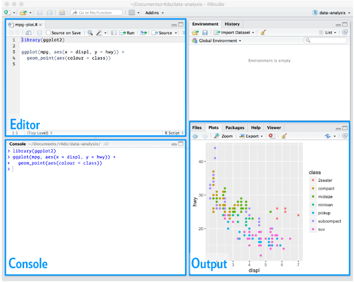

```{r setup, include=FALSE}
knitr::opts_chunk$set(
  echo = FALSE,
  message = FALSE,
  warning = FALSE,
  fig.width = 12,
  fig.height = 7
  )
```

```{r}
library(patchwork)
library(tidyverse)
library(gridtext)
```


## Bem Vindos!

<p style="text-align: justify"> O Departamento de Gestão da Informação - DGI gostaria de agradecer a sua participação no Workshop de Programação em R. Esse será o primeiro de um conjunto de dois workshops realizados pelo DGI/SAGI o qual pretende alinhar as necessidades e usos da programação ao ambiente de trabalho. </p> 

Esperamos que aproveitem o mesmo e desejamos uma excelente oficina.

Atenciosamente,

__Equipe__  
__DGI/SAGI__ 

## Dinâmica do Curso

- As aulas serão ministradas na modalidade remota via Microsoft Teams;
- As aulas serão gravadas e posteriormente disponibilizadas no Microsoft Stream; 
- O certificado de conclusão do curso será emitido conforme o preenchimento dos requesitos abaixo:
  - Presença mínima de 80% da carga horária total do workshop (total da oficina de 12h);
  - A presença será atribuída automaticamente com base no __relatório de participação do Teams__;
  - Entrega e resultado satisfatório nas atividades realizadas ao longo da oficina;
- Ao surgirem dúvidas, por favor, usar a ferramenta do Teams __levantar a mão__ para pedir a palavra ao instrutor.


## A plataforma didática

<p style="text-align: justify">Para essa série de workshops, foi desenvolvido um espaço cujo o objetivo é centralizar os materiais didático e pedagógico assim como as ferramentas de uso requeridas (Rstudio).  

Salientamos que a entrega das atividades será feita via repositório pessoal do __github__ APENAS.    
As instruções concernentes serão veiculadas conforme o decorrer da oficina.  

O endereço para o acesso da plataforma é: <http://10.68.14.110:8080/>  

__Lembramos que esse acesso está restrito à rede privada do Ministério:SOMENTE por meio de VPN ou localmente.__  
__Ao término da oficina, NÃO haverá suporte da plataforma: haverá a EXCLUSÂO de todo o conteúdo.__

</p>


## A Linguagem R


A linguagem R foi criada com base na linguagem de programação S, criada na década de 70. O R foi criado como uma alternativa de código aberto por volta dos anos 90, sendo utilizada por cientistas, estatísticos e, mais recentemente, cientistas de dados como um meio conveniente para a análise exploratória, inferência e modelagem de dados interativos.
Trata-se de uma linguágem de __código aberto__, __interpretada__ e __multiparadigma__, extensivamente usada para:

* Data Science;
* Machine Learning;
* Estatística Computacional.


## Rstudio




## Sessões do Rstudio

* __Editor/Scripts__: é onde escrevemos nossos códigos;
* __Console__: é onde rodamos o código e recebemos as saídas;
* __Output__: é onde temos acesso aos gráficos gerados, help, pacotes e arquivos do diretório de trabalho;
* __Data__: é onde encotramos informações sobre as variáveis criadas, conecções e histórico de comandos.
