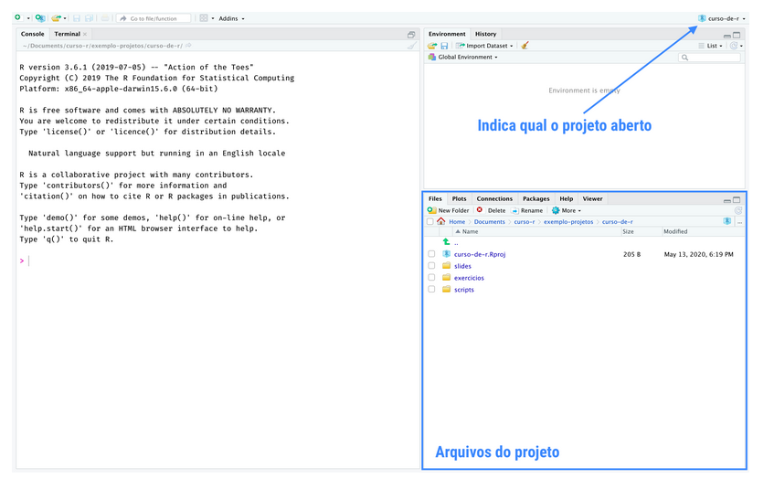
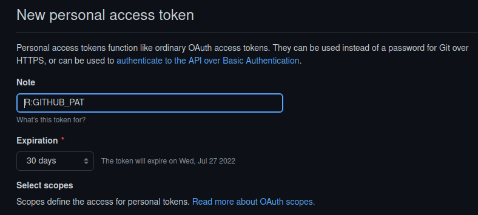
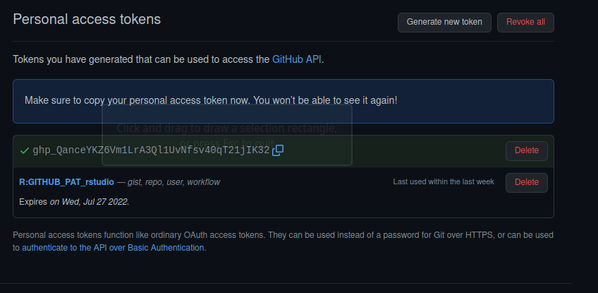
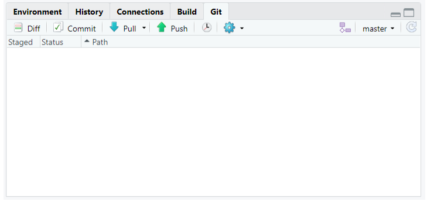
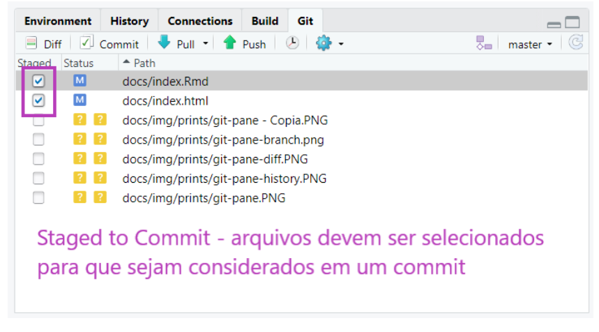

```{r setup, include=FALSE}
knitr::opts_chunk$set(
  #echo = FALSE,
  #message = FALSE,
  warning = FALSE,
  )
```

```{r, include=FALSE}
library(patchwork)
library(tidyverse)
library(gridtext)
```

## Projetos

Uma funcionalidade muito importante do RStudio é a possibilidade de criar projetos.

Um projeto é uma pasta no seu computador. Nessa pasta, estarão todos os arquivos que você usurá ou criará na sua análise.

A principal razão de utilizarmos projetos é organização. Com eles, fica muito mais fácil importar bases de dados para dentro do R, criar análises reprodutíveis e compartilhar o nosso trabalho.


## Rstudio e um projeto



## Git {.flexbox .vcenter}


## Github {.flexbox .vcenter}


## Configuração do Github no Rstudio (1)

Para a configuração da conta pessoal do Github no Rstudio, vamos usar o link abaixo, o qual possui um script para tal.

<https://github.com/dgi-workshops/github>

## Configuração do Github no Rstudio (2)

Com o seu usuário e e-mail alterar o comando abaixo, o qual usaremos no R.

* Alterar "YourName" pelo seu nome de usuário (não esquecer de deixa-lo entre aspas).
* Alterar "your@mail.com" pelo e-mail usado no cadastramento da conta do Github (não esquecer de deixá-lo entre aspas).


```{r}
# usethis::use_git_config(user.name = "YourName", user.email = "your@mail.com")
```

## Configuração do Github no Rstudio (3)

Passar o comando abaixo no R, para assim gerarmos um token de acesso para o Rstudio.

```{r}
# usethis::create_github_token()
```

Irá ser aberto uma janela nova no navegador para criação do nosso token



## Configuração do Github no Rstudio (4)

Ainda no github ao selecionarmos **GENERATE TOKEN**

Será apresentada a seguinte tela, com o código do nosso token.



**O token deve ser copiado/guardado com muito cuidado e por favor não deixar deixá-lo público.**

## Configuração do Github no Rstudio (5)

Com o código do token e seu nome, vamos terminar a nossa configuração, com o comando abaixo:

```{r}
# credentials::set_github_pat("YourPAT")
```

**Onde "YourPAT" deve ser alterado para o nome do nosso token (novamente entre aspas o nome)**

* Será aberta uma janela no Rstudio pedindo o código do token (aquele criado no slide anterior);
* Copiar o código nessa janela e apertar enter

**PRONTINHO!!! Terminamos de configurar o nosso Rstudio!!!**


## Git Pane {.flexbox .vcenter}


## Git Status {.flexbox .vcenter}
